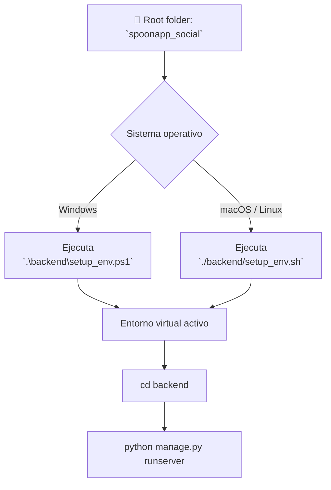

# SpoonApp Social

This Django project powers the SpoonApp social network. The repository separates
backend and frontend code. The backend resides in the `backend/` directory while
the modern JavaScript frontend lives inside the `frontend/` folder and is built
with [esbuild](https://esbuild.github.io/).

## Features
* Publicaciones con imagen estilo Instagram
* Comentarios, likes y contador de compartidos
* Vista de perfil para cada usuario

## Pantalla Principal

La pantalla principal de SpoonApp Social representa el corazón de la red social culinaria. Se trata de una interfaz inspirada en plataformas como Facebook, Instagram y TikTok, pero centrada exclusivamente en el contenido relacionado con comida, recetas, restaurantes y comunidades gastronómicas. El diseño se divide en tres columnas principales que estructuran la experiencia del usuario: navegación lateral izquierda, feed central de publicaciones, y una columna derecha con contenido patrocinado y gestión de amistades.

En la parte superior encontramos una barra fija de navegación (topbar) con fondo en tonos morados suaves, la cual incluye accesos rápidos a las funciones más importantes de la red social. De izquierda a derecha se presentan iconos que simbolizan: inicio (home), crear nueva publicación, acceder al sistema de mensajería, funcionalidades sociales como eventos o recuerdos, y configuración. Al final de esta barra se encuentra el avatar del usuario actual junto al botón “Profile”, que enlaza directamente con su perfil personal, donde podrá gestionar su información, contenido y preferencias.

A la izquierda, la interfaz presenta un menú lateral vertical que permite al usuario acceder a las principales secciones sociales de la plataforma. Este menú está compuesto por cinco apartados: Streams (transmisiones en vivo al estilo Twitch), Events (eventos relacionados con cocina o restaurantes), Friends (gestión de contactos y solicitudes de amistad), Memories (recuerdos o publicaciones destacadas), y Games (minijuegos interactivos de comida como trivias o retos tipo Kahoot). Justo debajo se encuentra un bloque especial titulado “Restaurants”, en el que se muestra una selección destacada de locales o comercios gastronómicos con su imagen, nombre, y un enlace directo a su sitio web. Este bloque permite a los restaurantes integrarse en la comunidad social con promociones y contenido multimedia, fomentando la interacción entre usuarios y negocios. Al final de esta sección se incluye un botón “See More” para ampliar la lista de restaurantes visibles.

En el centro se encuentra el feed principal de publicaciones, donde se muestra el contenido compartido por los usuarios. En la parte superior de este feed hay una barra para publicar nuevos posts, con un campo de texto que pregunta al usuario “What’s On Your Spoon?”, permitiendo añadir texto acompañado de una imagen y clasificándolo por categorías gastronómicas. La interfaz de publicación incluye un avatar del usuario a la izquierda y un botón con el icono de un avión de papel a la derecha para enviar. Debajo se muestran las publicaciones recientes: cada post presenta una imagen (en este ejemplo, un gato como contenido temporal), el nombre del autor o título del post (“My Beautiful Cat”), y una barra inferior de acciones con iconos personalizados. Estas acciones incluyen: un sistema de “me gusta” representado con una cuchara 🥄 y contador de likes, icono de burbuja de diálogo para mostrar la cantidad de comentarios, botón de compartir (avión), y marcador para guardar publicaciones de forma privada.

Finalmente, en la columna derecha, el usuario encuentra dos bloques adicionales. El primero corresponde a contenido patrocinado (Sponsored), donde se promocionan productos o restaurantes con descuento. Se presenta una imagen atractiva (una pizza), nombre del producto (“Pizza with Pepperoni”), sistema de valoración visual basado en cucharas, y una breve descripción del producto o promoción. Justo debajo se encuentra la sección Friends, que permite gestionar solicitudes de amistad y consultar el estado de conexión de los contactos actuales. Aquí se muestra un listado de amigos con sus nombres de usuario, imágenes de perfil y estado actual (por ejemplo, “Connected” o “Last time 42 minutes”), así como botones de acción como “Accept” o “Remove” para gestionar nuevas solicitudes.

El estilo visual está cuidadosamente adaptado a un público joven, moderno y centrado en la gastronomía. Se utilizan colores pastel (morado, rosa, amarillo claro), bordes redondeados, iconografía personalizada y fuentes amigables para reforzar el enfoque temático de comida. Todos los elementos están diseñados para ser accesibles y visualmente equilibrados tanto en pantallas de escritorio como en móviles.

En resumen, esta interfaz es una fusión clara de las funcionalidades de redes sociales generalistas, adaptadas a una temática única: la gastronomía. Cada componente está estratégicamente pensado para fomentar la interacción entre usuarios, negocios y creadores culinarios, y puede ser replicado con precisión mediante Django, integrando modelos como Post, Profile, Comment, Like, Story, FriendRequest o Restaurant. El diseño modular permite escalar fácilmente esta estructura hacia nuevas funciones como video en vivo, IA de recomendaciones, filtros de imágenes y almacenamiento masivo en la nube.

## Frontend
See `frontend/README.md` for setup and build instructions. After building, the
bundle is placed in `backend/static/js/main.js` and automatically loaded on the home page.

## Running
Ensure Python and Node.js are installed, then install Python dependencies from
`requirements.txt`:



Build the frontend:

```bash
cd frontend
npm install
npm run build
```

The translations are automatically compiled whenever `manage.py` is executed,
so you no longer need to run `django-admin compilemessages` manually. Selecting
a different language in the app also recompiles the translations automatically.

Run the Django development server:

```bash
cd backend
python manage.py runserver
```

If the `msgfmt` binary required for compiling translations is missing, `manage.py`
will attempt to install `gettext` using the available package manager
(APT on Linux, Homebrew on macOS or Chocolatey/Winget on Windows). If automatic
installation fails, install `gettext` manually. On Windows you can run
`choco install gettext` or `winget install -e --id GnuWin32.gettext`. Alternatively
download the prebuilt binaries from
[mlocati.github.io/gettext-iconv-windows](https://mlocati.github.io/articles/gettext-iconv-windows.html)
and add the `bin` directory to your `PATH`.
