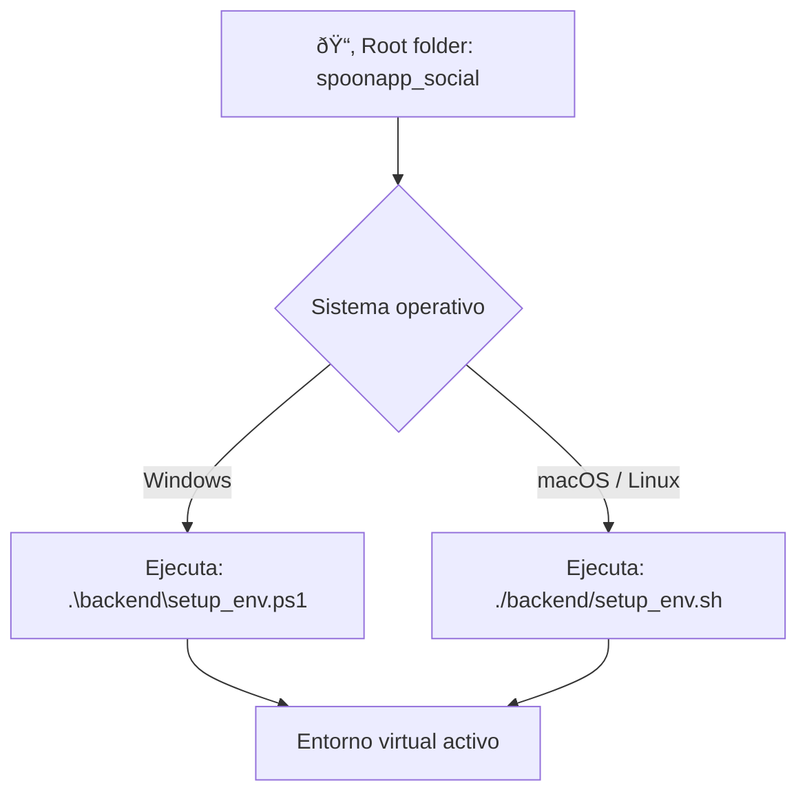

# SpoonApp Social

This Django project powers the SpoonApp social network. The repository separates
backend and frontend code. The backend resides in the `backend/` directory while
the modern JavaScript frontend lives inside the `frontend/` folder and is built
with [esbuild](https://esbuild.github.io/).

## Features
* Instagram-style image posts
* Comments, likes, and share counter
* Profile view for each user

## Frontend
See `frontend/README.md` for setup and build instructions. After building, the
bundle is placed in `backend/static/js/main.js` and automatically loaded on the home page.

## Running
Ensure Python and Node.js are installed, then install Python dependencies from
`requirements.txt`:

Build the virtual environment:



Build the frontend:

```bash
cd frontend
npm install
npm run build
```

The translations are automatically compiled whenever `manage.py` is executed,
so you no longer need to run `django-admin compilemessages` manually. Selecting
a different language in the app also recompiles the translations automatically.

Run the Django development server:

```bash
cd backend
python manage.py runserver
```

If the `msgfmt` binary required for compiling translations is missing, `manage.py`
will attempt to install `gettext` using the available package manager
(APT on Linux, Homebrew on macOS or Chocolatey/Winget on Windows). The script also
checks for a bundled distribution under `backend/tools/gettext` and automatically
adds its `bin` directory to the `PATH` when found. If automatic installation fails,
install `gettext` manually. On Windows you can run
`choco install gettext` or `winget install -e --id GnuWin32.gettext`. Alternatively
download the prebuilt binaries from
[mlocati.github.io/gettext-iconv-windows](https://mlocati.github.io/articles/gettext-iconv-windows.html).
